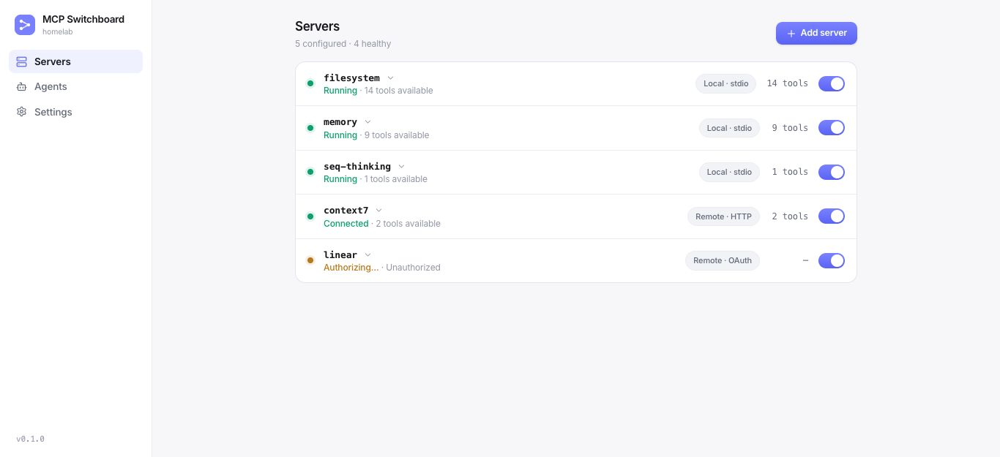
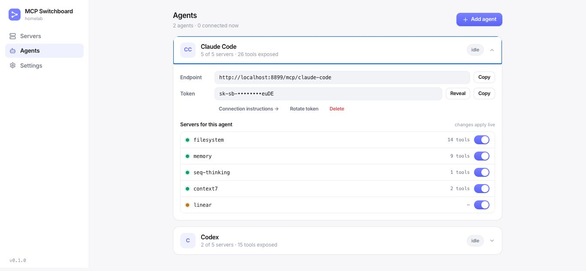
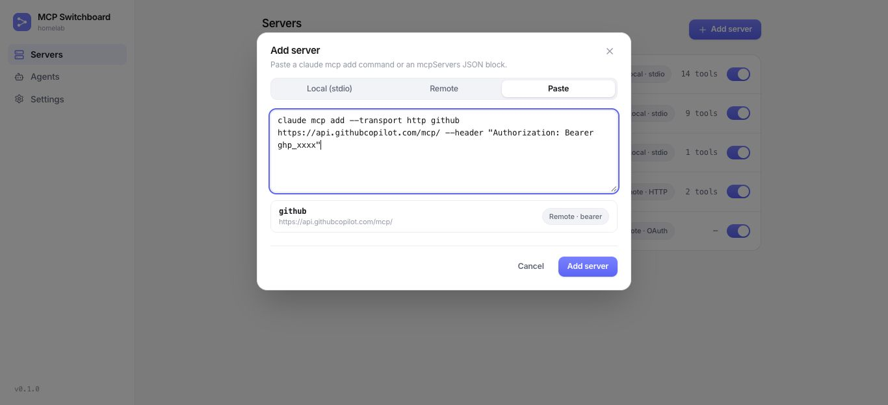

# MCP Switchboard

A small self-hosted switchboard for MCP: put all your MCP servers in one place and hand each of your coding agents (Claude Code, Codex, …) its own endpoint with exactly the servers you want it to see.



- **Local servers** — stdio processes (`npx …`, `uvx …`) spawned and supervised by the switchboard, with restart-on-crash and stderr logs.
- **Remote servers** — Streamable HTTP or SSE, with bearer-token, custom-header, or full OAuth 2.1 auth. OAuth tokens are stored encrypted and refreshed proactively in the background so auth never goes stale.
- **Per-agent switch matrix** — enable/disable each server per agent; changes apply live via `tools/list_changed`, no agent restart.
- **Paste to import** — paste a `claude mcp add …` command or an `mcpServers` JSON block into Add server → Paste; the switchboard parses it (multiple entries supported) and shows a preview before creating.
- **Namespaced tools** — `github__create_issue`, `google-work__gmail_search`. Multiple accounts of the same service are just multiple server entries with different slugs.
- **Agents know which account is which** — give each server a description ("Work Gmail — carl@company.com") and the switchboard weaves it into every tool description, the server instructions roster, and a built-in `switchboard__list_servers` tool agents can call to see slug, purpose, status, and tool count.
- **Homelab-simple auth** — one admin password for the UI, one bearer token per agent. Designed for a trusted LAN, not the public internet.

| Per-agent switch matrix | Paste to import |
| --- | --- |
|  |  |

## Quick start

```bash
npm install
npm run build
npm start          # serves UI + switchboard on http://localhost:8787
```

First visit prompts you to set the admin password. Development mode (hot reload):

```bash
npm run dev        # UI on http://localhost:5173, API/switchboard on :8787
```

## Docker

```bash
docker compose up -d --build   # switchboard on http://localhost:8787
```

State persists in `./data` on the host. If you access the switchboard from another machine, set `PUBLIC_URL` (e.g. `PUBLIC_URL=http://192.168.1.10:8787 docker compose up -d`) so OAuth redirects work.

## Connecting an agent

Create an agent in the UI, then use the connection snippet it shows. For Claude Code:

```bash
claude mcp add switchboard --transport http \
  http://<switchboard-host>:8787/mcp/<agent-slug> \
  --header "Authorization: Bearer <agent-token>"
```

## Configuration

| Env var | Default | Purpose |
| --- | --- | --- |
| `PORT` | `8787` | HTTP port |
| `DATA_DIR` | `./data` | SQLite DB + encryption key |
| `PUBLIC_URL` | `http://localhost:8787` | Base URL for OAuth redirect URIs — set to the LAN URL you open in your browser |

Backup = copy the `data/` directory (contains the database and the encryption key).

## Notes

- Secrets (env vars, tokens) are AES-256-GCM encrypted at rest with a key in `data/secret.key`. stdio child processes still receive their env vars in plaintext, necessarily.
- No TLS and no multi-user support by design; put Caddy/Tailscale in front if you want transport security.
