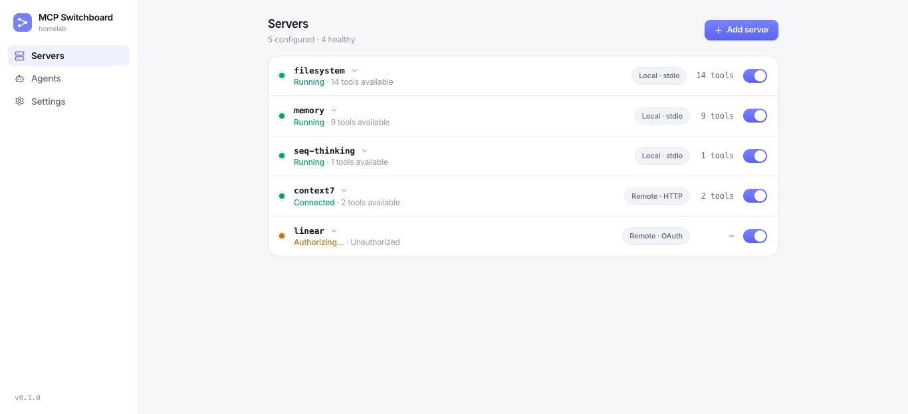
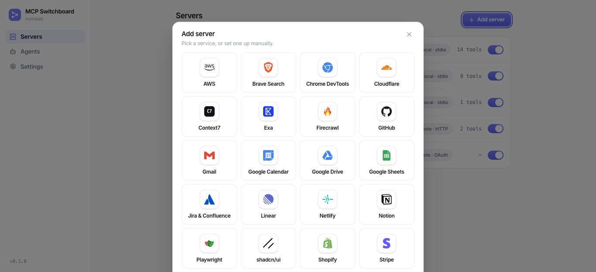
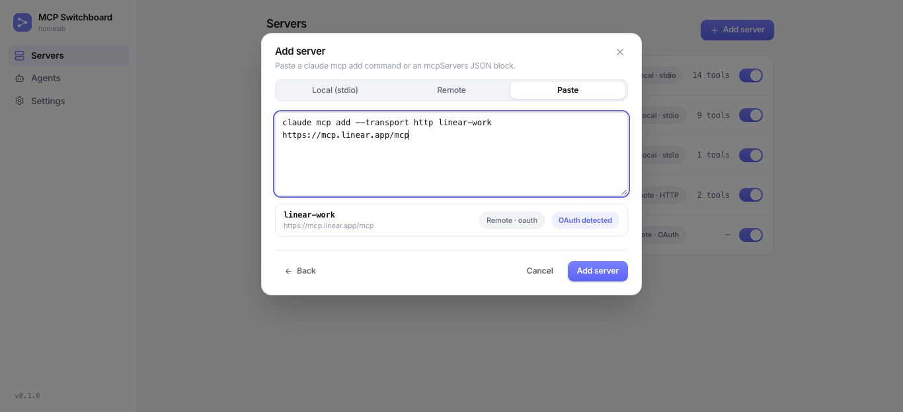
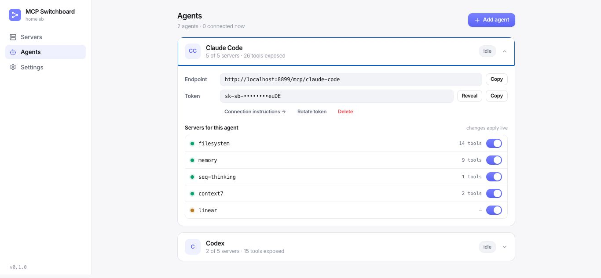
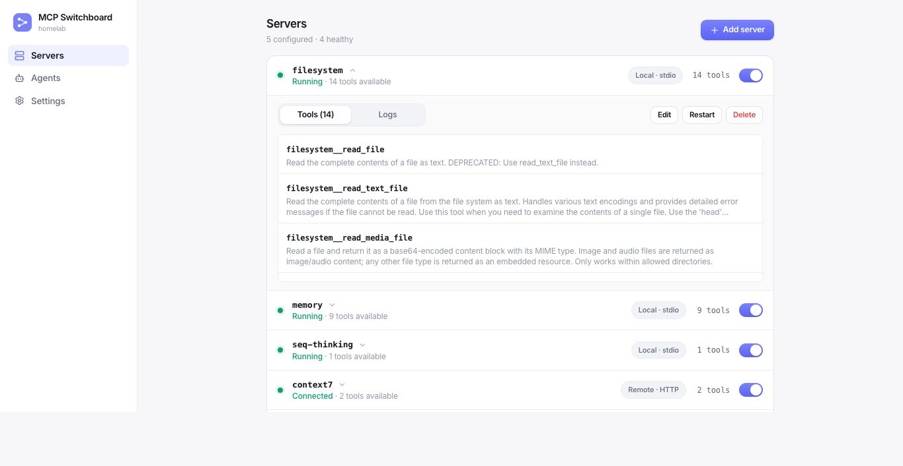
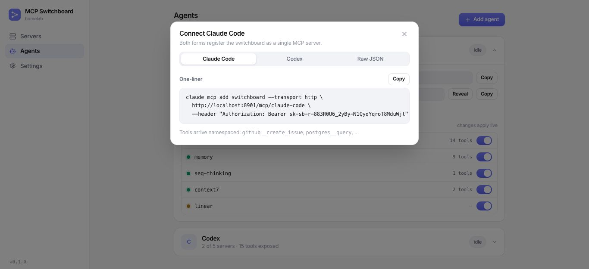
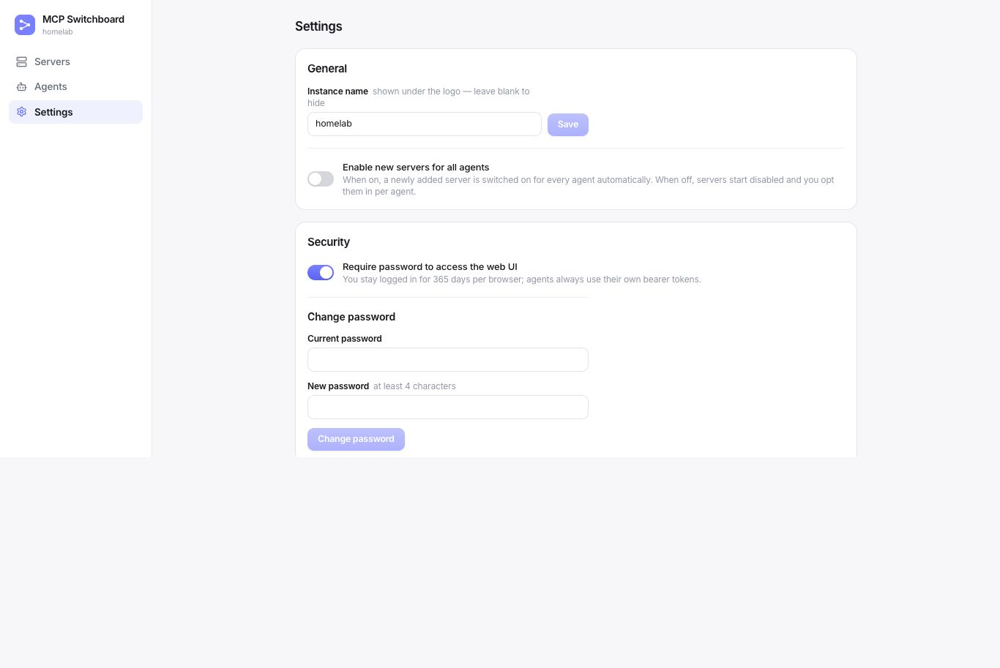

# MCP Switchboard

A small self-hosted switchboard for MCP: put all your MCP servers in one place and hand each of your coding agents (Claude Code, Codex, …) its own endpoint with exactly the servers you want it to see.



- **One-click templates** — add 20+ popular servers (GitHub, Linear, Jira & Confluence, Notion, Stripe, Shopify, Vercel, Netlify, Cloudflare, Supabase, AWS, Zapier, Gmail, Google Drive/Calendar/Sheets, Context7, shadcn/ui, Playwright, Chrome DevTools, Firecrawl, Exa, Brave Search) from a visual picker; OAuth servers go straight to the browser consent page, the rest ask only for the API key they need.
- **Local servers** — stdio processes (`npx …`, `uvx …`) spawned and supervised by the switchboard, with restart-on-crash and stderr logs.
- **Remote servers** — Streamable HTTP or SSE, with bearer-token, custom-header, or full OAuth 2.1 auth. OAuth tokens are stored encrypted and refreshed proactively in the background so auth never goes stale.
- **Per-agent switch matrix** — enable/disable each server per agent; changes apply live via `tools/list_changed`, no agent restart.
- **Paste to import** — paste a `claude mcp add …` command or an `mcpServers` JSON block into Add server → Paste config; the switchboard parses it (multiple entries supported) and shows a preview before creating.
- **Namespaced tools** — `github__create_issue`, `google-work__gmail_search`. Multiple accounts of the same service are just multiple server entries with different slugs.
- **Agents know which account is which** — give each server a description ("Work Gmail — carl@company.com") and the switchboard weaves it into every tool description, the server instructions roster, and a built-in `switchboard__list_servers` tool agents can call to see slug, purpose, status, and tool count.
- **Request logs** — every request an agent sent and the response it got, one line each, expandable to the exact JSON-RPC frames. Filter by agent, server, method, or errors / slow / in-flight; the list tails live. Kept 48h by default; retention and payload capture are configurable in Settings.
- **Homelab-simple auth** — one admin password for the UI, one bearer token per agent. Designed for a trusted LAN, not the public internet.

| Add from a template | Paste to import (auth auto-detected) |
| --- | --- |
|  |  |



| Tools & logs per server | One-click agent onboarding |
| --- | --- |
|  |  |

## Quick start

Requires Node 20+.

```bash
npx @cmer/mcp-switchboard          # switchboard on http://localhost:8787
```

First visit prompts you to set the admin password. State lives in
`~/.config/mcp-switchboard` — the same place on every run, so you can start it from anywhere.

To install it properly rather than running it from the npx cache:

```bash
npm install -g @cmer/mcp-switchboard
mcp-switchboard
```

Either way, the environment variables below still apply — e.g. to reach the switchboard from
another machine on your LAN:

```bash
PUBLIC_URL=http://192.168.1.10:8787 npx @cmer/mcp-switchboard
```

For a long-running install, Docker (below) is the better fit.

## From source

```bash
npm install
npm run build
npm start          # serves UI + switchboard on http://localhost:8787
```

Development mode (hot reload):

```bash
npm run dev        # UI on http://localhost:5173, API/switchboard on :8787
```

## Docker

```bash
docker compose up -d --build   # switchboard on http://localhost:8787
```

State persists in `./data` on the host. If you access the switchboard from another machine, set `PUBLIC_URL` (e.g. `PUBLIC_URL=http://192.168.1.10:8787 docker compose up -d`) so links and redirects point at the right host — but note that OAuth providers reject a plain-HTTP redirect that is not loopback, so also read [OAuth over plain HTTP](#oauth-over-plain-http).

## Connecting an agent

Create an agent in the UI, then use the connection snippet it shows. For Claude Code:

```bash
claude mcp add switchboard --transport http \
  http://<switchboard-host>:8787/mcp/<agent-slug> \
  --header "Authorization: Bearer <agent-token>"
```

### Claude Desktop, claude.ai and other OAuth-only clients

Clients that can't send a custom header — Claude Desktop and claude.ai custom connectors, for
instance — connect over OAuth instead. The switchboard is its own authorization server, so there is
no OAuth app to register anywhere:

1. Make `/mcp/<agent-slug>` reachable over **public HTTPS** (Caddy, Cloudflare Tunnel,
   `tailscale funnel`). Claude's connectors connect from Anthropic's cloud, not from your machine.
   Check that the switchboard advertises the same `https://` origin — see
   [Behind a reverse proxy](#behind-a-reverse-proxy).
2. In Claude: **Settings → Connectors → Add custom connector**, paste the full endpoint
   `https://<public-host>/mcp/<agent-slug>` (the bare host 404s), then keep **Sign in now** and
   **Register automatically** (dynamic client registration). "Claude's published identity" (CIMD)
   is not supported.
3. Claude opens an approval page served by the switchboard. On the Agents page, open the agent's
   **Connection instructions → Claude Desktop**, click **Generate pairing code**, type the code
   into the approval page and click **Approve**.

Pairing codes are single-use and expire after 10 minutes, so the agent's long-lived token never
has to be pasted into a web page. The approved client shows up under the agent's **OAuth
connections**, where it can be revoked. Access tokens last an hour and are refreshed automatically;
an unused connection lapses after 90 days. Static bearer tokens keep working alongside OAuth.

The authorization server lives next to `/mcp` (on `MCP_PORT` when the ports are split), because
Claude calls its token endpoint from the same place it calls the MCP endpoint.

## Lean mode

By default an agent's `tools/list` proxies every tool of every server enabled for it, full JSON
Schemas included — with many servers that can be 100+ definitions and tens of thousands of context
tokens per session. Flip an agent's **Tool exposure** to **Lean** (Agents page) and it instead sees
a constant-size set of meta-tools and discovers what it needs on demand:

1. `switchboard__search_tools { query: "send email" }` — ranked matches over the agent's enabled catalog
2. `switchboard__describe_tools { names: ["gmail__send_email"] }` — full descriptions, input/output shapes as compact TypeScript
3. `switchboard__call_tool { name, arguments }` — invoke the tool

Full mode remains the default and is unchanged. Lean is worth it for agents with large catalogs or
many enabled servers; the per-agent switch matrix still controls what is visible and callable either
way, and the toggle applies to live sessions immediately.

## Configuration

Settings → General/Security covers the instance name, auto-enabling new servers for every agent, changing the admin password, and — for fully trusted networks — turning web-UI auth off entirely:



Two groups of variables, one per audience. The `PUBLIC_*` pair is the easy one to mix up: the
switchboard talks OAuth in two directions, and each direction has its own URL.

- **Upstream OAuth** — the switchboard signing in *to* Linear, Xero, Stripe, … from your browser.
  The provider redirects your browser back to `PUBLIC_URL`.
- **Agent OAuth** — Claude Desktop / claude.ai signing in *to* the switchboard. Claude's cloud
  reaches the agent endpoint, and the metadata it reads must name that endpoint's public origin
  (`MCP_PUBLIC_URL`, or the request itself when unset).

**The admin UI and upstream servers**

| Env var | Default | Purpose |
| --- | --- | --- |
| `PORT` | `8787` | Port for the UI, REST API — and `/mcp/<slug>` unless `MCP_PORT` is set |
| `HOST` | all interfaces | Interface the UI/API listener binds to |
| `PUBLIC_URL` | `http://localhost:8787` | The URL **you open the UI at in your browser**. Upstream OAuth redirect URIs are built from it (`<PUBLIC_URL>/oauth/callback`). Not used by agents — with one exception: when it is `https://`, a request for that same host is known to be TLS even if a proxy hop says otherwise |
| `DATA_DIR` | `~/.config/mcp-switchboard` | SQLite DB + encryption key (respects `XDG_CONFIG_HOME`; the Docker image sets this to `/app/data`) |

**The agent endpoint (`/mcp/<slug>`)**

| Env var | Default | Purpose |
| --- | --- | --- |
| `MCP_PORT` | unset (shares `PORT`) | Serve the agent endpoint on its own port — see [below](#splitting-the-agent-endpoint-onto-its-own-port) |
| `MCP_HOST` | `HOST` | Interface the MCP listener binds to |
| `MCP_PUBLIC_URL` | see right | The origin **agents use to reach `/mcp/<slug>`**, without the path. Two consumers: the connection snippets in the UI (unset → the UI's own origin, or `PUBLIC_URL` with the port swapped when `MCP_PORT` is set), and the agent OAuth metadata (unset → derived from each request; see [Behind a reverse proxy](#behind-a-reverse-proxy)). Set it whenever agents come in through a proxy or tunnel |

Typical setups:

| Setup | Set |
| --- | --- |
| Everything on localhost | nothing |
| LAN only, plain HTTP | `PUBLIC_URL=http://192.168.1.10:8787` (and read [OAuth over plain HTTP](#oauth-over-plain-http)) |
| One HTTPS hostname for UI and agents | `PUBLIC_URL=https://sb.example.com` — add `MCP_PUBLIC_URL` with the same value if the metadata check below fails |
| UI on the LAN/tailnet, agents through a public tunnel | `PUBLIC_URL=<what you open in the browser>`, `MCP_PUBLIC_URL=https://<public-host>` |

Backup = copy the data directory (contains the database and the encryption key).

### OAuth over plain HTTP

OAuth 2.1 providers — Linear and most others — only accept a redirect URI that is `https` or a
loopback address. A `PUBLIC_URL` like `http://nas.lan:8787` or `http://192.168.1.10:8787` therefore
gets authorization refused before you ever see a consent screen. Two ways out:

1. **Terminate TLS.** Caddy, a Cloudflare Tunnel, or `tailscale serve --bg 8787` all give you an
   `https://` hostname with a real certificate. `PUBLIC_URL=https://…` then works with no further
   ceremony, and your admin cookie and agent tokens stop crossing the network in the clear.
2. **Open the UI through a loopback port-forward** (`ssh -L 8787:localhost:8787 nas`) and leave
   `PUBLIC_URL` at its `http://localhost:8787` default. The callback comes back down the tunnel, so
   authorization stays automatic. Agents still reach `/mcp/<slug>` over the LAN — set
   `MCP_PUBLIC_URL` so the connection snippets show the address they should use.

Changing `PUBLIC_URL` after a server has been authorized invalidates its registration with the
provider, because the redirect URI it registered no longer exists. The switchboard notices and
registers again on the next authorization, so the fix is to click **Authorize** on that server once
more.

### Behind a reverse proxy

When `MCP_PUBLIC_URL` is unset, the agent OAuth metadata is built from the incoming request,
honouring `X-Forwarded-Proto` and `X-Forwarded-Host`. That works for a single proxy that terminates
TLS. It breaks when:

- **Proxies are chained over plain HTTP** — e.g. Cloudflare → Caddy, where Cloudflare talks HTTP to
  Caddy. Caddy reports *its* hop as `X-Forwarded-Proto: http`, so the metadata advertises
  `http://…` and Claude rejects it. An `https://` `PUBLIC_URL` for the same host fixes the scheme
  automatically; otherwise set `MCP_PUBLIC_URL`, or have Caddy send
  `header_up X-Forwarded-Proto https`.
- **The proxy rewrites `Host`** and doesn't send `X-Forwarded-Host`.

Check what Claude will see — the `resource` must be exactly the URL you paste into the connector:

```bash
curl -s https://<public-host>/.well-known/oauth-protected-resource/mcp/<agent-slug>
# {"resource":"https://<public-host>/mcp/<agent-slug>","authorization_servers":["https://<public-host>"],…}
```

Anything `http://`, or a different host, means `MCP_PUBLIC_URL=https://<public-host>` is needed.

### Splitting the agent endpoint onto its own port

By default one port serves everything: the UI, the REST API and `/mcp/<agent-slug>`. Set `MCP_PORT`
and the switchboard opens a second listener — same process, same database, same upstream
connections — that serves **only** the agent endpoint. The UI port stops serving `/mcp/*` entirely.

```bash
MCP_PORT=8788 HOST=127.0.0.1 MCP_HOST=0.0.0.0 mcp-switchboard
```

That combination keeps the admin UI on loopback (reach it via SSH tunnel or Tailscale) while the
agent endpoint listens on every interface, ready to be forwarded or reverse-proxied to the outside.
The endpoint is still bearer-token authenticated, and there is still no TLS — put Caddy or a tunnel
in front of the MCP port before exposing it to the internet, and set `MCP_PUBLIC_URL` to the URL
agents will actually use so the connection snippets in the UI match.

## Notes

- Secrets (env vars, tokens) are AES-256-GCM encrypted at rest with a key in `secret.key` inside the data directory, which is created `0700`. stdio child processes still receive their env vars in plaintext, necessarily.
- No TLS and no multi-user support by design; put Caddy/Tailscale in front if you want transport security.
